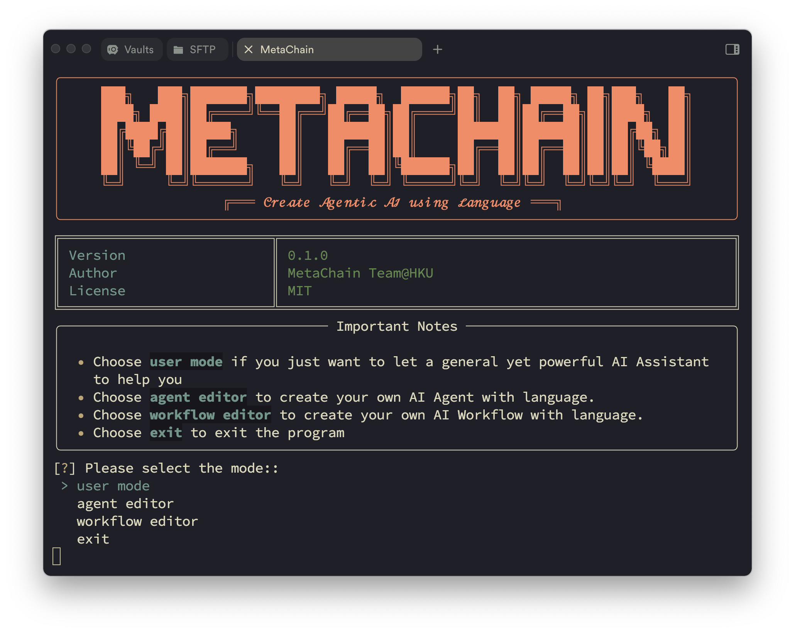

<a name="readme-top"></a>

<div align="center">
  
  <h1 align="center">MetaChain: Fully-Automated & Zero-Code</br> LLM Agent Framework </h1>
</div>


<div align="center">
  <a href="https://metachain-ai.github.io"></a>
  <a href="https://join.slack.com/t/metachain-workspace/shared_invite/zt-2zibtmutw-v7xOJObBf9jE2w3x7nctFQ"></a>
  <a href="https://discord.gg/z68KRvwB"></a>
  <br/>
  <a href="https://metachain-ai.github.io/docs"></a>
  <a href="#"></a>
  <a href="https://gaia-benchmark-leaderboard.hf.space/"></a>
  <hr>
</div>

Welcome to MetaChain! MetaChain is a **Fully-Automated** and highly **Self-Developing** framework that enables users to create and deploy LLM agents through **Natural Language Alone**. 

## ✨Key Features

* 🏆 Top Performer on the GAIA Benchmark
MetaChain has secured the **#1** spot among open-sourced methods, delivering comparable performance to **OOpenAI's Deep Research**O.

* 📚 Agentic-RAG with Native Self-Managing Vector Database
* MetaChain equipped with a native self-managing vector database, outperforms industry-leading solutions like **LangChain**. 

* ✨ Agent and Workflow Create with Ease
* MetaChain leverages natural language to effortlessly build ready-to-use **tools**, **agents** and **workflows** - no coding required.

* 🌐 Universal LLM Support
* MetaChain seamlessly integrates with **A Wide Range** of LLMs (e.g., OpenAI, Anthropic, Deepseek, vLLM, Grok, Huggingface ...)

* 🔀 Flexible Interaction 
* Benefit from support for both **function-calling** and **ReAct** interaction modes.

* 🤖 Dynamic, Extensible, Lightweight 
MetaChain is your **Personal AI Assistant**, designed to be dynamic, extensible, customized, and lightweight.

🚀 Unlock the Future of LLM Agents. Try 🔥MetaChain🔥 Now!

<div align="center">
  <!--  -->
  <figure>
    
    <figcaption><em>Quick Overview of MetaChain.</em></figcaption>
  </figure>
</div>


## 🔥 News

<div class="scrollable">
    <ul>
      <li><strong>[2025, Feb 10]</strong>: &nbsp;🎉🎉We've released <b>MetaChain!</b>, including framework, evaluation codes and CLI mode! Check our <a href="./assets/paper/metachain_arxiv.pdf">paper</a> for more details.</li>
    </ul>
</div>

<span id='table-of-contents'/>

## 📑 Table of Contents

* <a href='#features'>✨ Features</a>
* <a href='#news'>🔥 News</a>
* <a href='#quick-start'>⚡ Quick Start</a>
  * <a href='#installation'>Installation</a>
  * <a href='#api-keys-setup'>API Keys Setup</a>
  * <a href='#start-with-cli-mode'>Start with CLI Mode</a>
* <a href='#how-to-use'>🔍 How to Use MetaChain</a>
  * <a href='#user-mode'>1. `user mode` (SOTA 🏆 Open Deep Research)</a>
  * <a href='#agent-editor'>2. `agent editor` (Agent Creation without Workflow)</a>
  * <a href='#workflow-editor'>3. `workflow editor` (Agent Creation with Workflow)</a>
* <a href='#todo'>☑️ Todo List</a>
* <a href='#reproduce'>🔬 How To Reproduce the Results in the Paper</a>
* <a href='#documentation'>📖 Documentation</a>
* <a href='#community'>🤝 Join the Community</a>
* <a href='#acknowledgements'>🙏 Acknowledgements</a>
* <a href='#cite'>🌟 Cite</a>

<span id='quick-start'/>

## ⚡ Quick Start

<span id='installation'/>

### Installation

#### MetaChain Installation

```bash
git clone https://github.com/HKUDS/MetaChain.git
cd MetaChain
pip install -e .
```

#### Docker Installation

We use Docker to containerize the agent-interactive environment. So please install [Docker](https://www.docker.com/) first. And pull the pre-built image with the following command.

```bash
docker pull tjbtech1/metachain:latest
```

<span id='api-keys-setup'/>

### API Keys Setup

Create a environment variable file, just like `.env.template`, and set the API keys for the LLMs you want to use. Not every LLM API Key is required, use what you need.

```bash
# Required Github Tokens of your own
GITHUB_AI_TOKEN=

# Optional API Keys
OPENAI_API_KEY=
DEEPSEEK_API_KEY=
ANTHROPIC_API_KEY=
GEMINI_API_KEY=
HUGGINGFACE_API_KEY=
GROQ_API_KEY=
XAI_API_KEY=
```

<span id='start-with-cli-mode'/>

### Start with CLI Mode
Just run the following command to start the CLI mode. (use shell script `cd path/to/MetaChain && sh playground/cli/metachain_cli.sh`)

```bash
current_dir=$(dirname "$(readlink -f "$0")")

cd $current_dir
cd ../.. 
export DOCKER_WORKPLACE_NAME=workplace
export EVAL_MODE=True
export BASE_IMAGES=tjbtech1/metachain:latest
export COMPLETION_MODEL=claude-3-5-sonnet-20241022
export DEBUG=False # If you want to see detailed messages of agents' actions, set to True
export MC_MODE=True # If you want to ignore the retry information of LLM connection, set to True
export AI_USER=tjb-tech # Your Github username

port=12345 # The port of the agent-interactive environment

python playground/cli/metachain_cli.py --container_name quick_start --model ${COMPLETION_MODEL} --test_pull_name mirror_branch_0207 --debug --port ${port} --git_clone
```

After the CLI mode is started, you can see the start page of MetaChain: 

<div align="center">
  <!--  -->
  <figure>
    
    <figcaption><em>Start Page of MetaChain.</em></figcaption>
  </figure>
</div>

More features coming soon! 🚀 **Web GUI interface** under development.

<span id='how-to-use'/>

## 🔍 How to Use MetaChain

<span id='user-mode'/>

### 1. `user mode` (SOTA 🏆 Open Deep Research)

MetaChain have a out-of-the-box multi-agent system, which you could choose `user mode` in the start page to use it. This multi-agent system is a general AI assistant, having the same functionality with **OpenAI's Deep Research** and the comparable performance with it in [GAIA](https://gaia-benchmark-leaderboard.hf.space/) benchmark. 

- 🚀 **High Performance**: Matches Deep Research using Claude 3.5 rather than OpenAI's o3 model.
- 🔄 **Model Flexibility**: Compatible with any LLM (including Deepseek-R1, Grok, Gemini, etc.)
- 💰 **Cost-Effective**: Open-source alternative to Deep Research's $200/month subscription
- 🎯 **User-Friendly**: Easy-to-deploy CLI interface for seamless interaction
- 📁 **File Support**: Handles file uploads for enhanced data interaction

<table>
<tr align="center">
    <td width="33%">
        
        <br>
        <em>Input your request.</em>
    </td>
    <td width="33%">
        
        <br>
        <em>Agent will give you the response.</em>
    </td>
    <td width="33%">
        
        <br>
        <em>Use @ to mention the agent you want to use. (Optional)</em>
    </td>
</tr>
</table>
<table>
<tr align="center">
    <td width="33%">
        
        <br>
        <em>@Upload_files will help you upload the files.</em>
    </td>
    <td width="33%">
        
        <br>
        <em>Select the files you want to use.</em>
    </td>
    <td width="33%">
        
        <br>
        <em>Successfully uploaded the files.</em>
    </td>
</tr>
</table>

<span id='agent-editor'/>

### 2. `agent editor` (Agent Creation without Workflow)

The most distinctive feature of MetaChain is its natural language customization capability. Unlike other agent frameworks, MetaChain allows you to create tools, agents, and workflows using natural language alone. Simply choose `agent editor` or `workflow editor` mode to start your journey of building agents through conversations.

You can use `agent editor` as shown in the following figure.

<table>
<tr align="center">
    <td width="33%">
        
        <br>
        <em>Input what kind of agent you want to create.</em>
    </td>
    <td width="33%">
        
        <br>
        <em>Automated agent profiling.</em>
    </td>
    <td width="33%">
        
        <br>
        <em>Output the agent profiles.</em>
    </td>
</tr>
</table>
<table>
<tr align="center">
    <td width="33%">
        
        <br>
        <em>Create the desired tools.</em>
    </td>
    <td width="33%">
        
        <br>
        <em>Input what do you want to complete with the agent. (Optional)</em>
    </td>
    <td width="33%">
        
        <br>
        <em>Create the desired agent(s) and go to the next step.</em>
    </td>
</tr>
</table>

<span id='workflow-editor'/>

### 3. `workflow editor` (Agent Creation with Workflow)

You can also create the agent workflows using natural language description with the `workflow editor` mode, as shown in the following figure. (Tips: this mode does not support tool creation temporarily.)

<table>
<tr align="center">
    <td width="33%">
        
        <br>
        <em>Input what kind of workflow you want to create.</em>
    </td>
    <td width="33%">
        
        <br>
        <em>Automated workflow profiling.</em>
    </td>
    <td width="33%">
        
        <br>
        <em>Output the workflow profiles.</em>
    </td>
</tr>
</table>
<table>
<tr align="center">
    <td width="33%">
        
        <br>
        <em>Input what do you want to complete with the workflow. (Optional)</em>
    </td>
    <td width="33%">
        
        <br>
        <em>Create the desired workflow(s) and go to the next step.</em>
    </td>
</tr>
</table>

<span id='todo'/>

## ☑️ Todo List

MetaChain is continuously evolving! Here's what's coming:

- 📊 **More Benchmarks**: Expanding evaluations to **SWE-bench**, **WebArena**, and more
- 🖥️ **GUI Agent**: Supporting *Computer-Use* agents with GUI interaction
- 🔧 **Tool Platforms**: Integration with more platforms like **Composio**
- 🏗️ **Code Sandboxes**: Supporting additional environments like **E2B**
- 🎨 **Web Interface**: Developing comprehensive GUI for better user experience

Have ideas or suggestions? Feel free to open an issue! Stay tuned for more exciting updates! 🚀

<span id='reproduce'/>

## 🔬 How To Reproduce the Results in the Paper

### GAIA Benchmark
For the GAIA benchmark, you can run the following command to run the inference.

```bash
cd path/to/MetaChain && sh evaluation/gaia/scripts/run_infer.sh
```

For the evaluation, you can run the following command.

```bash
cd path/to/MetaChain && python evaluation/gaia/get_score.py
```

### Agentic-RAG

For the Agentic-RAG task, you can run the following command to run the inference.

Step1. Turn to [this page](https://huggingface.co/datasets/yixuantt/MultiHopRAG) and download it. Save them to your datapath.

Step2. Run the following command to run the inference.

```bash
cd path/to/MetaChain && sh evaluation/multihoprag/scripts/run_rag.sh
```

Step3. The result will be saved in the `evaluation/multihoprag/result.json`.

<span id='documentation'/>

## 📖 Documentation

A more detailed documentation is coming soon 🚀, and we will update in the [Documentation](https://metachain-ai.github.io/docs) page.

<span id='community'/>

## 🤝 Join the Community

We want to build a community for MetaChain, and we welcome everyone to join us. You can join our community by:

- [Join our Slack workspace](https://join.slack.com/t/metachain-workspace/shared_invite/zt-2zibtmutw-v7xOJObBf9jE2w3x7nctFQ) - Here we talk about research, architecture, and future development.
- [Join our Discord server](https://discord.gg/z68KRvwB) - This is a community-run server for general discussion, questions, and feedback. 
- [Read or post Github Issues](https://github.com/HKUDS/MetaChain/issues) - Check out the issues we're working on, or add your own ideas.


<span id='acknowledgements'/>

## 🙏 Acknowledgements

Rome wasn't built in a day. MetaChain stands on the shoulders of giants, and we are deeply grateful for the outstanding work that came before us. Our framework architecture draws inspiration from [OpenAI Swarm](https://github.com/openai/swarm), while our user mode's three-agent design benefits from [Magentic-one](https://github.com/microsoft/autogen/tree/main/python/packages/autogen-magentic-one)'s insights. We've also learned from [OpenHands](https://github.com/All-Hands-AI/OpenHands) for documentation structure and many other excellent projects for agent-environment interaction design, among others. We express our sincere gratitude and respect to all these pioneering works that have been instrumental in shaping MetaChain.


<span id='cite'/>

## 🌟 Cite

```tex
@misc{metachain,
      title={{MetaChain: A Fully-Automated and Zero-Code Framework for LLM Agents}},
      author={Jiabin Tang, Tianyu Fan, Chao Huang},
      year={2025},
      eprint={202502.xxxxx},
      archivePrefix={arXiv},
      primaryClass={cs.AI},
      url={https://arxiv.org/abs/2502.xxxxx},
}
```


